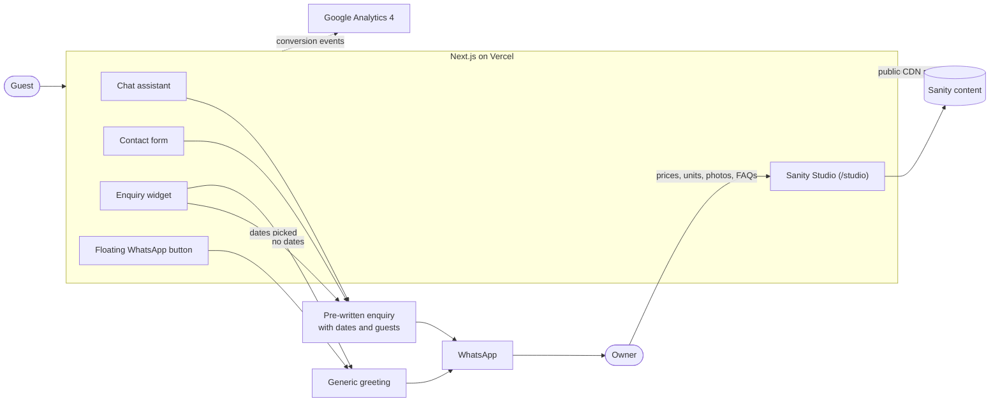
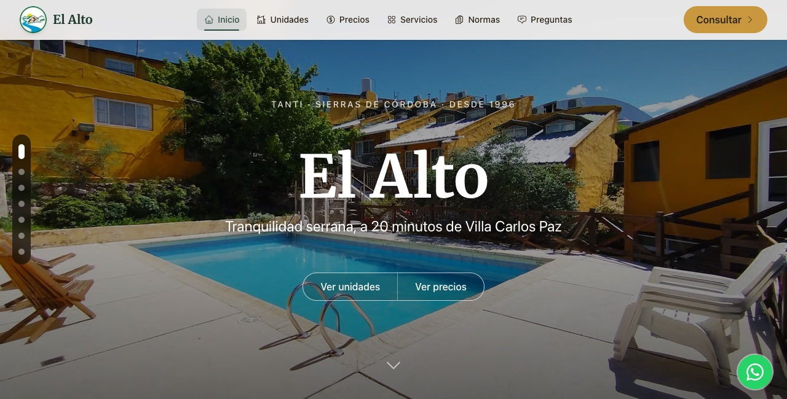
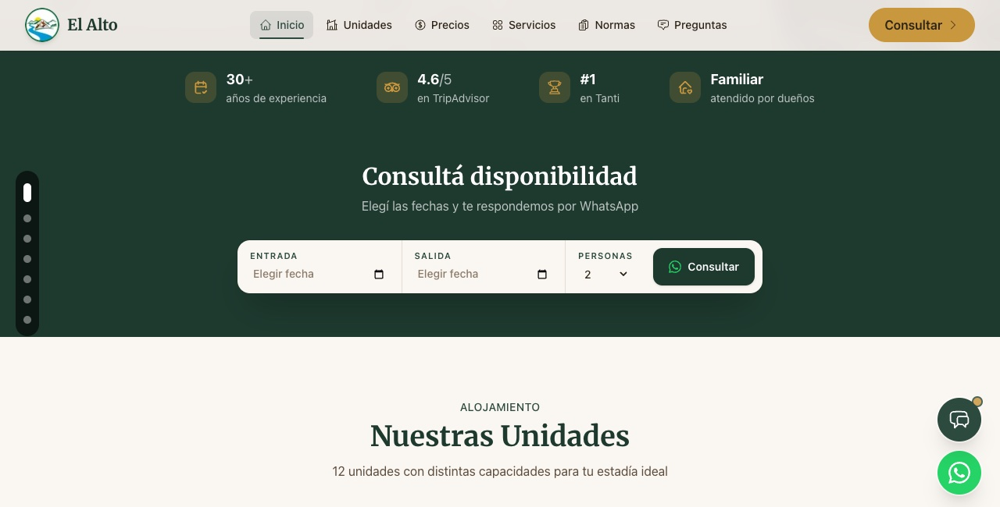
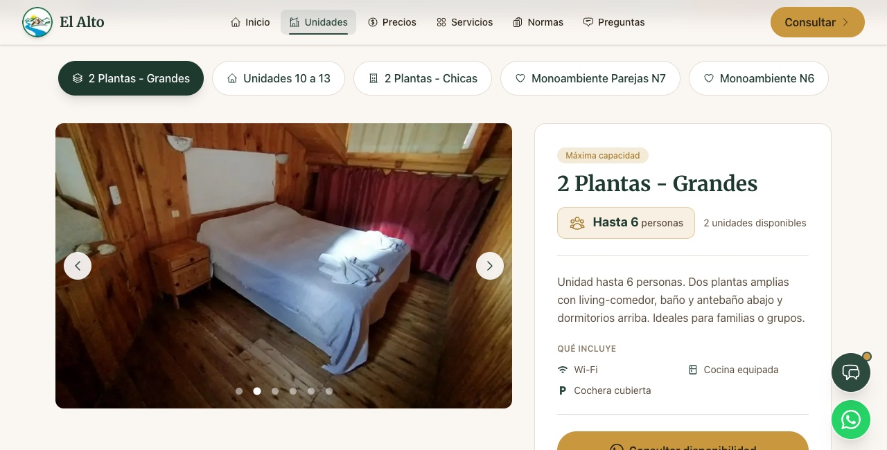
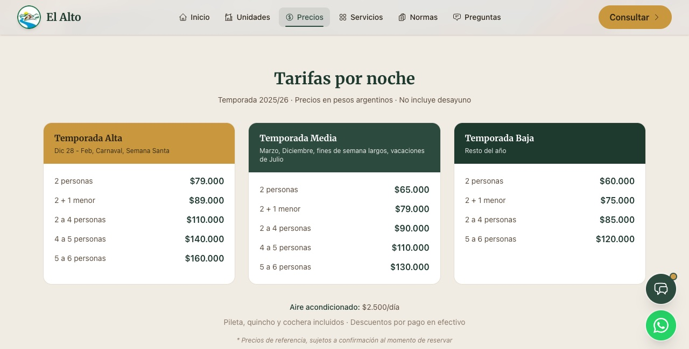

# 🏔️ Complejo El Alto

Website built for a 30-year-old family-run apartment complex in Tanti, Córdoba, Argentina.

🌐 **Live:** [www.complejoelalto.com.ar](https://www.complejoelalto.com.ar)

## The Problem

The old WordPress site had placeholder text, spelling errors, and a broken contact flow. 80% of WhatsApp inquiries came in as just "Hola", with no dates and no guest count. That left an already busy owner relying on back-and-forth messaging with many guests at the same time.

## The Solution

- **Enquiry widget right below the hero.** Guests pick check-in, check-out and guest count, and WhatsApp opens with the message already written. Impossible dates are flagged before anything is sent; with no dates, it still opens WhatsApp with a generic message.
- **Contact form & chatbot** that collect the same details before handing off to WhatsApp, plus a floating WhatsApp button on every page.
- **Sanity CMS.** The owner updates prices himself (they change weekly with Argentine inflation), as well as units, homepage videos and the rest of the content.
- **Prices page** of its own, the most visited part of the old site.
- **Built for phones first.** Tested in Safari on iOS and Chrome on Android. The hero is sized to the visible screen area, not `100vh`, so nothing sits behind the browser bars.
- **SEO:** server-rendered content, `LodgingBusiness` and `VideoObject` structured data, and an `llms.txt` so AI assistants read the site without running JavaScript.
- **Google Analytics 4** tracks visits and conversions: `whatsapp_click`, `chatbot_open`, `chatbot_option`, `video_play`.

## How it works

Every way in ends in WhatsApp. The assistant and the contact form always send a complete enquiry; the widget does when the guest picks dates, and the floating button opens a generic greeting. The owner keeps the content up to date in the Studio, and the site reads it from Sanity.



## Decisions

- **WhatsApp instead of a booking engine.** The owner already takes every reservation over WhatsApp and has no availability system to sync with. The site's job is to make the first message complete, with dates and guest count, not to replace that conversation.
- **A lean Studio.** Only what the owner actually changes is editable: prices, units, photos, videos and FAQs. Content that never changes lives in code, so there are no dead fields to confuse the owner or drift from what the site shows.
- **A scripted assistant, not an AI chatbot.** Fixed answers and quick replies, all ending in WhatsApp. The prices and units answers are built from the same Sanity documents as the pages, so they can't contradict them.
- **Everything in the HTML.** FAQs and unit details are server-rendered, even where they're collapsed on screen, so search engines and AI assistants can read them.
- **Left out on purpose:** online payments, guest accounts and an automated test suite. Every PR runs lint, a typecheck and a production build, and the guest flows are tested by hand on phones.
## Tech Stack

Next.js 16 · TypeScript · Tailwind CSS 4 · Sanity · Vercel · Google Analytics 4

## Screenshots

<p>
  
  
  
  
</p>

## Setup
```bash
git clone https://github.com/LeoCba07/el-alto-website.git
cd el-alto-website
npm install
```

Create `.env.local`:
```env
NEXT_PUBLIC_SANITY_PROJECT_ID=your_project_id
NEXT_PUBLIC_SANITY_DATASET=production
NEXT_PUBLIC_GA_ID=G-XXXXXXXXXX
NEXT_PUBLIC_SITE_URL=https://your-domain.com

# Optional: password-protect /studio with basic auth (skipped when unset)
STUDIO_USER=
STUDIO_PASS=

# Only for the scripts below: a Sanity token with write access
SANITY_API_TOKEN=
```
```bash
npm run dev
```

## Deploys

`main` deploys straight to production on Vercel. Work goes on a branch, which gets a Vercel preview, and reaches `main` only once it has been reviewed. Every PR also runs lint, a typecheck and a production build in GitHub Actions ([`ci.yml`](.github/workflows/ci.yml)).

## Structure
```
src/
├── app/        # Pages (App Router)
├── components/ # React components
└── sanity/     # Schemas & queries
scripts/        # One-off Sanity seed & migration scripts
docs/           # Session logs: what changed, why, and what's left
```

## Scripts

Seed scripts (populate Sanity content):

```bash
npm run seed:servicios                                # featured services
npx tsx scripts/seed-unidades-destacadas.ts           # featured units
```

One-off migrations already applied in production (kept for reference), run with `node --env-file=.env.local scripts/<name>.mjs`:

- `migrate-cabana-to-unidad.mjs` — renamed the `cabana` document type to `unidad`
- `migrate-chatbot-cabanas-to-unidades.mjs` — updated chatbot keys to match
- `fix-chatbot-response-text.mjs` — fixed chatbot texts still mentioning "cabañas"

All of them need `SANITY_API_TOKEN` with write access. Create a short-lived token for the job rather than keeping a permanent one in `.env.local`.

## CMS Content

The owner edits content in Sanity Studio (`/studio`):

- Unit types, descriptions and photos
- Pricing by season
- Homepage: hero, featured units panel, featured services and videos (YouTube links)
- FAQs and chatbot answers
- Testimonials
- Contact info, hours and social links

---

Built by [LeoCba07](https://github.com/LeoCba07)
